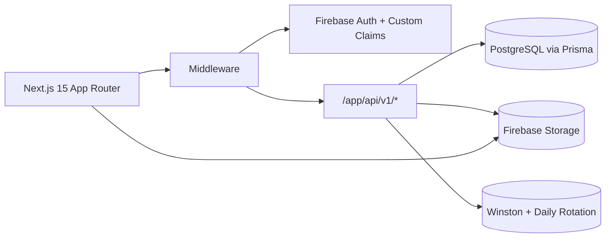

# SOURCE OF TRUTH - Miami Duplex Remodel Construction Management System

```yaml
repo: FAXAS_PROPERTY
commit: 7e42a71 (latest)
generatedAt: 2025-01-18T00:00:00Z
node: 20+
next: 15.5.0
typescript: ^5
prisma: ^6.14.0
tailwind: ^3.4.17
reactQuery: ^5.85.5
firebase: 12.1.0 / 13.4.0 (admin)
```

## Executive Snapshot {#executive-snapshot}

**Purpose**: This document serves as the authoritative and deterministic Source of Truth for the Miami Duplex Remodel Construction Management System. It provides comprehensive technical documentation enabling any AI agent or developer to understand, maintain, and extend the system.

**System Overview**: A production-ready construction management platform built with Next.js 15 App Router, featuring dual dashboards (Admin/Staff and Contractor), role-based access control (RBAC), real-time collaboration, and automated workflows. The system manages projects, tasks, budgets, procurement, RFPs/bidding, and contractor portals with mobile-first responsive design.

### Architecture Diagram



## Document Structure

Due to the comprehensive nature of this codebase, the Source of Truth is split into the following sections:

### Core Documentation
1. **[Data & Schema](docs/01-data-schema.md)** - Complete Prisma schema, ERD, models, relationships
2. **[API Inventory](docs/02-api-inventory.md)** - All API routes with auth, schemas, examples
3. **[Frontend Routes & Components](docs/03-frontend.md)** - Pages, layouts, components, props
4. **[Authentication & Security](docs/04-auth-security.md)** - Firebase auth, RBAC, session management
5. **[State Management](docs/05-state-management.md)** - React Query, contexts, hooks
6. **[Operations & DevOps](docs/06-operations.md)** - Commands, scripts, deployment
7. **[Design System](docs/07-design-system.md)** - Tailwind, shadcn/ui, mobile patterns

### Quick Reference Tables

## Directory & File Inventory Summary {#inventory}

| Category | Count | Key Paths |
|----------|-------|-----------|
| **App Routes** | 85 | `/app/admin/*`, `/app/contractor/*`, `/app/(auth)/*` |
| **API Routes** | 80+ | `/app/api/v1/*`, `/app/api/webhooks/*` |
| **Components** | 85 | `/components/ui/*`, `/components/blocks/*`, `/components/tasks/*` |
| **Hooks** | 10 | `/hooks/use-api.ts`, `/hooks/use-responsive.ts` |
| **Lib Utils** | 36 | `/lib/api/*`, `/lib/validations/*`, `/lib/services/*` |
| **Scripts** | 14 | `/scripts/*.ts`, `/scripts/*.mjs` |
| **Tests** | 9 | `/__tests__/security/*` |
| **Config** | 20+ | `next.config.js`, `tailwind.config.ts`, `prisma/schema.prisma` |

## Technology Stack {#stack}

| Layer | Technology | Version | Purpose |
|-------|------------|---------|---------|
| **Framework** | Next.js | 15.5.0 | App Router, SSR/SSG |
| **Language** | TypeScript | ^5 | Type safety |
| **Database** | PostgreSQL | Latest | Primary data store |
| **ORM** | Prisma | ^6.14.0 | Database abstraction |
| **Auth** | Firebase | 12.1.0/13.4.0 | Authentication |
| **UI Framework** | React | 19.1.0 | Component framework |
| **State** | TanStack Query | ^5.85.5 | Server state management |
| **Styling** | Tailwind CSS | ^3.4.17 | Utility-first CSS |
| **Components** | shadcn/ui | Latest | Component library |
| **Forms** | React Hook Form | ^7.62.0 | Form management |
| **Validation** | Zod | ^4.0.17 | Schema validation |
| **Logging** | Winston | ^3.17.0 | Structured logging |

## Route Groups & Access Control {#routes}

| Group | Path Pattern | Auth Required | Roles | Key Features |
|-------|--------------|---------------|-------|--------------|
| **Public** | `/`, `/login`, `/accept-invite` | No | Any | Login, contractor invites |
| **Admin** | `/admin/*` | Yes | ADMIN, STAFF | Full project management |
| **Contractor** | `/contractor/*` | Yes | CONTRACTOR | Module-based access |
| **API v1** | `/api/v1/*` | Yes | Varies | RESTful endpoints |
| **Webhooks** | `/api/webhooks/*` | Header | System | External integrations |

## Core Data Models {#models}

| Model | Purpose | Key Relations | Indexes |
|-------|---------|---------------|---------|
| **User** | System users | Contact, Tasks, ProjectMember | email (unique) |
| **Project** | Project container | All entities | status, dates |
| **Task** | Work items | User/Contact dual assignment | projectId, status, dueDate |
| **Contact** | External contacts | Portal access, Tasks | projectId, portalStatus |
| **BudgetItem** | Budget tracking | Procurement, WorkPackage | projectId, discipline |
| **Procurement** | Material orders | BudgetItem, Contact | projectId, orderStatus |
| **Rfp** | Bid requests | RfpItem, Bid, Award | projectId, status |
| **Bid** | Vendor proposals | BidItem, Vendor | rfpId, vendorId |
| **ScheduleEvent** | Calendar items | Project | projectId, start |

## API Endpoints Summary {#api-summary}

| Resource | Base Path | Methods | Auth | Key Operations |
|----------|-----------|---------|------|----------------|
| **Projects** | `/api/v1/projects` | CRUD | Yes | Create, list, archive, favorite |
| **Tasks** | `/api/v1/tasks` | CRUD | Yes | Status updates, bulk delete |
| **Contacts** | `/api/v1/contacts` | CRUD | ADMIN | Invite portal users |
| **Budget** | `/api/v1/budget` | CRUD | ADMIN | Exceptions, summary |
| **Procurement** | `/api/v1/procurement` | CRUD | Varies | Approval, analytics, export |
| **RFPs** | `/api/v1/rfps` | CRUD | ADMIN | Publish, tabulation |
| **Bids** | `/api/v1/bids` | CRUD | CONTRACTOR | Submit, withdraw |
| **Schedule** | `/api/v1/schedule` | CRUD | Varies | Today's events, approval |
| **Users** | `/api/v1/users` | CRUD | ADMIN | Permissions, preferences |

## Authentication & Authorization Matrix {#auth-matrix}

| Resource | Action | ADMIN | STAFF | CONTRACTOR | VIEWER | Evidence |
|----------|--------|:-----:|:-----:|:----------:|:------:|----------|
| Projects | create | ✓ | ✓ | ✗ | ✗ | `api/v1/projects/route.ts:requireRole(['ADMIN','STAFF'])` |
| Tasks | create | ✓ | ✓ | ○ | ✗ | `api/v1/tasks/route.ts:module check` |
| Tasks | view | ✓ | ✓ | ○ | ✓ | `api/v1/tasks/route.ts:requireAuth()` |
| Contacts | manage | ✓ | ✓ | ✗ | ✗ | `api/v1/contacts/route.ts:requireRole(['ADMIN','STAFF'])` |
| Budget | edit | ✓ | ○ | ✗ | ✗ | `api/v1/budget/route.ts:requireRole(['ADMIN'])` |
| Procurement | approve | ✓ | ✗ | ✗ | ✗ | `api/v1/procurement/[id]/approve/route.ts` |
| RFPs | create | ✓ | ✗ | ✗ | ✗ | `api/v1/rfps/route.ts:requireRole(['ADMIN'])` |
| Bids | submit | ✗ | ✗ | ✓ | ✗ | `api/v1/bids/route.ts:vendorAccess` |

Legend: ✓ = Full access, ○ = Module-dependent, ✗ = No access

## Environment Variables {#env-vars}

| Variable | Required | Purpose | Used In |
|----------|:--------:|---------|---------|
| `DATABASE_URL` | ✓ | PostgreSQL connection | `lib/prisma.ts` |
| `NEXT_PUBLIC_FIREBASE_API_KEY` | ✓ | Firebase client | `lib/firebaseClient.ts` |
| `NEXT_PUBLIC_FIREBASE_AUTH_DOMAIN` | ✓ | Firebase auth | `lib/firebaseClient.ts` |
| `NEXT_PUBLIC_FIREBASE_PROJECT_ID` | ✓ | Firebase project | `lib/firebaseClient.ts` |
| `NEXT_PUBLIC_FIREBASE_STORAGE_BUCKET` | ✓ | File storage | `lib/firebaseClient.ts` |
| `FIREBASE_SERVICE_ACCOUNT_BASE64` | ✓ | Admin SDK | `lib/firebaseAdmin.ts` |
| `WEBHOOK_SECRET` | ✓ | Webhook auth | `api/webhooks/*` |
| `JWT_AUDIENCE` | ○ | Token validation | `lib/api/session.ts` |
| `SENTRY_DSN` | ○ | Error tracking | `lib/logger.ts` |

## Key Commands {#commands}

### Development
```bash
npm run dev                  # Start dev server (port 3000)
npm run build               # Production build
npm run lint                # ESLint checks
npm run typecheck           # TypeScript validation
```

### Database
```bash
npx prisma generate         # Generate Prisma client
npx prisma db push          # Push schema (dev)
npx prisma migrate dev      # Create migrations
npx prisma migrate deploy   # Apply migrations (prod)
npx prisma studio           # Database GUI (port 5555)
npm run db:seed            # Seed initial data
```

### Testing
```bash
npm run test                # All tests
npm run test:security       # Security tests
npm run test:security:ci    # CI security tests
```

### Scripts
```bash
npm run create-admin        # Create admin user
tsx scripts/backup-database.ts     # Backup DB
tsx scripts/restore-database.ts    # Restore DB
tsx scripts/ensure-project-members.ts  # Fix memberships
```

## State Management Overview {#state}

### Query Keys Registry
- `['projects']` - All projects
- `['tasks', query]` - Tasks with filters
- `['task', id]` - Single task
- `['contacts', { projectId }]` - Project contacts
- `['schedule', { projectId }]` - Schedule events
- `['budget', { projectId }]` - Budget items
- `['procurement', query]` - Procurement items
- `['rfps', { projectId }]` - Project RFPs
- `['bids', { rfpId }]` - RFP bids
- `['user-preferences']` - User settings

### Mutation → Invalidation Matrix

| Mutation | Invalidates | Optimistic | Evidence |
|----------|-------------|:----------:|----------|
| createTask | `['tasks']`, `['tasks', {projectId}]` | No | `hooks/use-api.ts:35` |
| updateTask | `['tasks']`, `['task', id]` | No | `hooks/use-api.ts:65` |
| updateTaskStatus | `['tasks']`, `['task']` | No | `hooks/use-api.ts:95` |
| createContact | `['contacts']` | No | `hooks/use-api.ts:165` |
| updateBudget | `['budget']`, `['budget-summary']` | No | `hooks/use-api.ts:280` |

## Security Posture {#security}

### Authentication Flow
1. User signs in via Firebase (Google OAuth or Email/Password)
2. Firebase issues ID token with custom claims (role, modules)
3. Token sent as `Authorization: Bearer <token>` header
4. Server validates token via Firebase Admin SDK
5. Token refreshed every ~50 minutes automatically
6. Session management with optional session IDs

### Input Validation
- All API inputs validated with Zod schemas (`lib/validations/*`)
- SQL injection prevented via Prisma parameterized queries
- XSS prevention via React's automatic escaping
- CSRF protection via SameSite cookies

### Rate Limiting
- Implemented in `lib/api/rate-limit.ts`
- Default: 100 requests per minute per IP
- Configurable per endpoint

## Observability {#observability}

### Logging
- **Framework**: Winston with daily rotation
- **Directory**: `logs/` with automatic cleanup
- **Correlation IDs**: Generated per request
- **Levels**: error, warn, info, debug
- **Security events**: Separate security log channel

### Error Handling
- Centralized error response via `lib/api/response.ts`
- Structured error codes for client handling
- Stack traces in development only
- Sentry integration (optional)

## Performance Optimizations {#performance}

### Next.js
- Static generation for public pages
- Dynamic routes with `revalidate` options
- Image optimization with next/image
- Bundle splitting per route

### Database
- Indexes on frequently queried fields
- Compound indexes for complex queries
- Connection pooling via Prisma
- Query optimization with includes

### Client
- React Query caching (5 min default)
- Lazy loading with Suspense
- Virtual scrolling for large lists
- Optimistic updates for better UX

## Mobile-First Design Patterns {#mobile}

### Responsive Breakpoints
- Mobile: < 640px (default)
- Tablet: 640px - 1024px
- Desktop: > 1024px

### Touch Targets
- Minimum 48px for all interactive elements
- Swipe gestures for common actions
- Bottom sheets for mobile modals
- FAB for quick actions

### Adaptive Components
- Card view on mobile, table on desktop
- Bottom navigation on mobile
- Responsive grid layouts
- Touch-friendly date/time pickers

## Testing Coverage {#testing}

### Security Tests
- RBAC enforcement (`__tests__/security/rbac.test.ts`)
- IDOR prevention (`__tests__/security/idor.test.ts`)
- Rate limiting (`__tests__/security/rate-limit.test.ts`)
- Data protection (`__tests__/security/data-protection.test.ts`)
- Security headers (`__tests__/security/security-headers.test.ts`)

### Coverage Targets
- Security: 80% minimum
- API routes: 70% minimum
- Critical paths: 90% minimum

## Deployment {#deployment}

### Docker
- Multi-stage build in `Dockerfile`
- Environment-specific configs
- Health checks included
- Automatic migrations on startup

### Reverse Proxy
- Caddy server configuration
- Automatic HTTPS with Let's Encrypt
- WebSocket support for real-time
- Compression and caching headers

## Gaps & Probes {#gaps}

### Known Limitations
1. **Real-time sync**: WebSocket implementation pending
2. **Offline mode**: Partial implementation for mobile
3. **File versioning**: Single version storage only
4. **Bulk operations**: Limited to tasks currently

### Suggested Probes
- Search for WebSocket implementation: `grep -r "socket\|ws://" app/ lib/`
- Find offline handlers: `grep -r "offline\|sync\|queue" app/`
- Check file versioning: `grep -r "version.*file\|revision" lib/`
- Locate bulk endpoints: `grep -r "bulk" app/api/`

---

## JSON Sidecar {#json-sidecar}

```json
{
  "repo": {
    "name": "FAXAS_PROPERTY",
    "commit": "7e42a71",
    "generatedAt": "2025-01-18T00:00:00Z",
    "node": "20+",
    "next": "15.5.0",
    "prisma": "6.14.0",
    "typescript": "5+"
  },
  "routes": [
    {"path": "/", "file": "app/page.tsx", "group": "public", "auth": false},
    {"path": "/login", "file": "app/(auth)/login/page.tsx", "group": "public", "auth": false},
    {"path": "/admin", "file": "app/admin/page.tsx", "group": "admin", "roles": ["ADMIN", "STAFF"], "auth": true},
    {"path": "/contractor", "file": "app/contractor/page.tsx", "group": "contractor", "roles": ["CONTRACTOR"], "auth": true}
  ],
  "api": [
    {"path": "/api/v1/projects", "method": "GET,POST", "auth": true, "roles": ["ADMIN", "STAFF"]},
    {"path": "/api/v1/tasks", "method": "GET,POST,PUT,DELETE", "auth": true, "roles": ["ALL"]},
    {"path": "/api/v1/contacts", "method": "GET,POST,PUT,DELETE", "auth": true, "roles": ["ADMIN", "STAFF"]},
    {"path": "/api/v1/budget", "method": "GET,POST,PUT,DELETE", "auth": true, "roles": ["ADMIN"]}
  ],
  "models": [
    {"name": "User", "fields": 5, "relations": ["Contact", "Task", "ProjectMember"]},
    {"name": "Project", "fields": 30, "relations": ["Task", "BudgetItem", "Contact", "Rfp"]},
    {"name": "Task", "fields": 40, "relations": ["User", "Contact", "Project"]}
  ],
  "hooks": [
    {"name": "useProjects", "file": "hooks/use-api.ts", "queryKeys": ["projects"]},
    {"name": "useTasks", "file": "hooks/use-api.ts", "queryKeys": ["tasks"], "invalidates": ["tasks"]}
  ],
  "components": 85,
  "env": [
    {"name": "DATABASE_URL", "required": true, "usedIn": ["lib/prisma.ts"]},
    {"name": "NEXT_PUBLIC_FIREBASE_API_KEY", "required": true, "usedIn": ["lib/firebaseClient.ts"]}
  ],
  "security": {
    "validation": "zod",
    "auth": "firebase",
    "rbac": ["ADMIN", "STAFF", "CONTRACTOR", "VIEWER"],
    "rateLimit": true,
    "cors": true
  },
  "state": {
    "authContext": true,
    "queryKeys": ["projects", "tasks", "contacts", "budget", "procurement", "schedule", "rfps", "bids"]
  },
  "logging": {
    "winston": true,
    "dailyRotation": true,
    "logDir": "logs",
    "correlationId": true
  }
}
```

---

## Navigation

For detailed information, please refer to the split documentation files:

1. **[Data & Schema Documentation →](docs/01-data-schema.md)**
2. **[API Inventory Documentation →](docs/02-api-inventory.md)**
3. **[Frontend Documentation →](docs/03-frontend.md)**
4. **[Auth & Security Documentation →](docs/04-auth-security.md)**
5. **[State Management Documentation →](docs/05-state-management.md)**
6. **[Operations Documentation →](docs/06-operations.md)**
7. **[Design System Documentation →](docs/07-design-system.md)**

---

*Generated: 2025-01-18 | Miami Duplex Remodel Construction Management System v0.1.0*