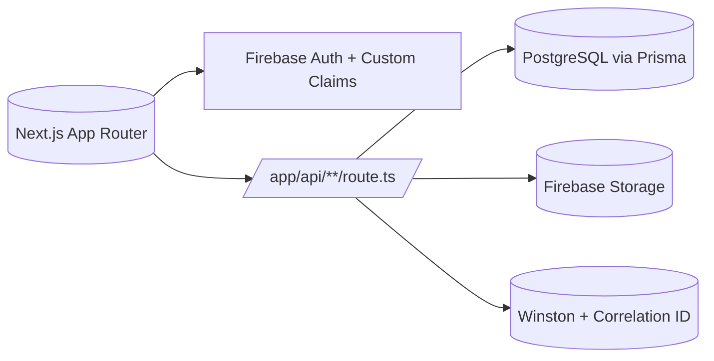
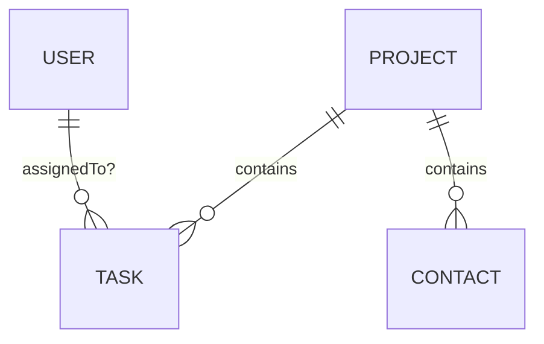
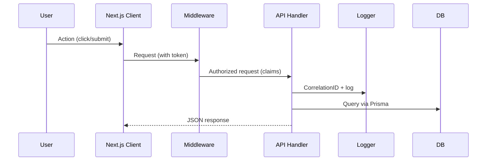
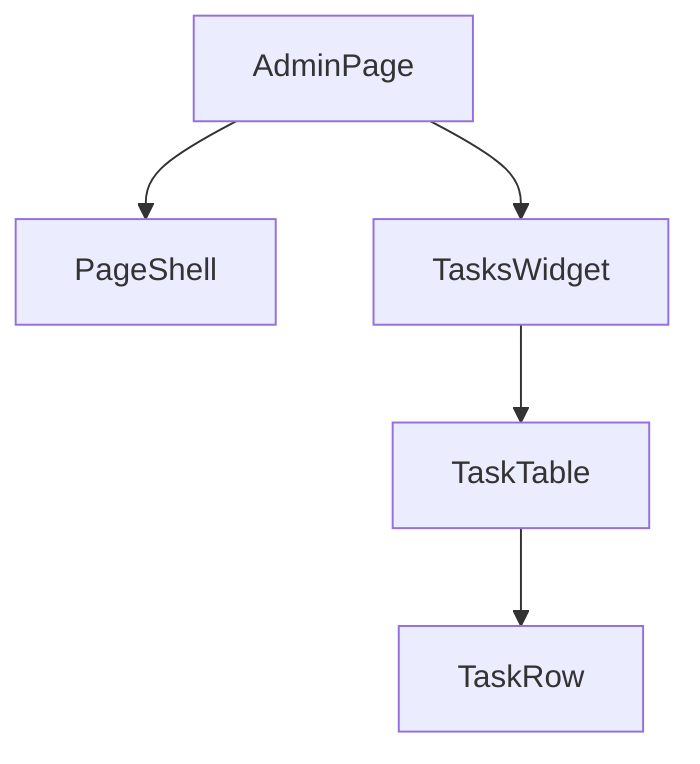

## 0) Objective

Create one exhaustive, deterministic **Source of Truth** for the **Miami Duplex Remodel – Construction Management System** repository. The document must enable any AI or developer to instantly understand **architecture, data, APIs, auth, state, components, styling, deployment, and operations** with precise references to source files.

**Primary deliverable:** `SOURCE_OF_TRUTH.md` at repo root.  
**Secondary (if needed for size):** a `/docs/` folder with section splits, linked from `SOURCE_OF_TRUTH.md`.

---

## 1) Grounding Context (treat as initial constraints)

Use these as *expected truths* from project guidance; **verify in code** and mark discrepancies:

- **Framework/Stack:** Next.js **15** App Router, TypeScript, Tailwind CSS (dark‑only, graphite/glass morphism), shadcn/ui, TanStack Query (React Query), React Hook Form + Zod, Prisma ORM, PostgreSQL, Firebase Auth (Google + Email/Password), Firebase Storage, Winston logging.
- **Route Groups:**  
  - Public: `/`, `/login`, `/accept-invite`  
  - Admin: `/admin/*` (roles: `ADMIN`, `STAFF`)  
  - Contractor: `/contractor/*` (role: `CONTRACTOR`)
- **Auth:** Firebase Auth with **custom claims** for roles (`ADMIN`, `STAFF`, `CONTRACTOR`, `VIEWER`); client `AuthContext` for state; server checks via helpers (e.g., `requireAuth`, `requireRole`); **token refresh ~ every 50 minutes** (verify).
- **Data Models (high level):** `User`, `Project`, `Task`, `Contact`, `Schedule/ScheduleEvent`, `BudgetItem`, `Procurement`, `UserPreferences` (and possibly `PlanFile`, `Decision`, `Risk`, `Invoice`, `AuditLog`, `UserModuleAccess`).
- **Patterns:** RESTful `/api/v1/*` with Zod validation; signed URL uploads (Firebase Storage); webhooks protect with header `x-webhook-secret`; correlation IDs via logger; daily log rotation.

> **Rule:** Document only what the code proves. If guidance and code disagree, **note discrepancy** in a “Gaps & Discrepancies” section.

---

## 2) Process You Must Follow (no skipping)

1. **Build File Inventory (Authoritative Index)**
   - Produce a complete list of all files in the repository **excluding** `node_modules`, build artifacts (`.next`, `dist`, `out`, coverage), and locks of vendored deps.
   - For each file: record **path**, **kind** (page/layout/component/hook/api/util/model/script/style/config), **group** (public/admin/contractor/api/shared), and **notes** if detectable.
   - Derive Next.js App Router structure by locating `page.tsx`, `layout.tsx`, `loading.tsx`, `error.tsx`, `template.tsx`, `default.tsx`, and **API route handlers** under `app/api/**/route.ts`.
   - **Use this inventory as the single source**. Do not document any path not listed here.

2. **Extract Versions & Metadata**
   - From `package.json` / lockfiles and CLI if available: Node, Next.js, Prisma, TypeScript, Tailwind, TanStack Query versions.
   - If available, record current **commit hash** and **generated timestamp**.

3. **Parse & Map the Backend**
   - **Prisma:** Load `prisma/schema.prisma` → enumerate models, enums, relations, indexes, defaults, constraints. Detect mutual exclusivity patterns (e.g., dual assignment). Locate migrations (filenames, order).
   - **API:** Enumerate **every** `app/api/**/route.ts`. For each method (GET/POST/PUT/DELETE, etc.) actually implemented in the file, extract:
     - Auth guard (`requireAuth/requireRole/claims`), role requirements.
     - Request/response **Zod** schemas (or inferred shape).
     - Correlation/logging usage (Winston).
     - Example `curl` and `fetch` requests.
     - Errors (codes/messages) and status codes.
   - **Auth/Middleware:** Read `middleware.ts`, `lib/api/auth-check.ts` (or similar), `lib/firebaseAdmin.ts`/`lib/firebaseClient.ts`. Document session/refresh strategy (≈50 minutes), cookie/storage usage, SSR vs CSR access, and route protection rules.
   - **Storage/Webhooks:** Identify Firebase Storage use (signed URL helpers), webhook endpoints and their secrets (names only), and validation logic.

4. **Parse & Map the Frontend**
   - **Routes:** For every `page.tsx`/`layout.tsx`:
     - Path, auth requirement, roles, SSR/CSR behavior, associated `loading.tsx`/`error.tsx`, dynamic params, metadata, and linked components/hooks.
   - **Components:** For every component in `components/**`:
     - **Paste the actual `Props` interface/type** or derive the inferred props (state the source file/symbol). Note side-effects, accessibility notes, mobile behaviors (48px targets, bottom sheets), shadcn/tailwind usage.
   - **Hooks (`hooks/**`):** For each hook:
     - Signature (params/returns), used query keys, staleTime/cache strategy, mutations and **invalidation** targets, optimistic update & rollback behavior.
   - **State:** Map `AuthContext` and all TanStack Query **query keys** into a canonical registry; show mutation→invalidation matrix.

5. **Env & Secrets Policy**
   - List **names only** of environment variables. For each: required?, default?, used in (file path), description.
   - Never print secret values. If `.env*` is present, parse names only.

6. **Observability & Security**
   - **Logging:** Winston setup, transports, formats, correlation id creation/propagation, log directory (daily rotation).
   - **Security posture:** AuthZ rules per route; input validation with Zod; output encoding; rate limiting (if present); storage access; PII handling guidelines. Note risks (CSRF/XSS/SSRF/IDOR) and hardening seen in code.

7. **Performance & Caching**
   - Next.js route caching flags (`dynamic`, `revalidate`), `fetch` cache settings.
   - Prisma query patterns & indexes used to avoid N+1.
   - Client perf techniques (lazy load, Suspense, bundle insights).

8. **Testing & QA**
   - Test commands, CI jobs, security tests, coverage thresholds (if any).
   - E2E/system/integration tests present or recommended (tie to invariants and RBAC).

9. **Ops & Runbooks**
   - Commands for dev/build/lint/typecheck; Prisma generate/migrate/push/studio/seed; backup/restore scripts; create-admin; deployment notes if present.

10. **Design System**
    - Tailwind theme extensions, custom utilities (e.g., glass), dark-only policy.
    - shadcn primitives used and component conventions.
    - Mobile-first rules and responsive grid patterns.

11. **Finish With Gaps**
    - Anything missing: add to **Gaps & Probes** with file paths and **suggested grep searches** to resolve.

---

## 3) Writing Rules (strict)

- **Deterministic structure, no fluff.** Write for AI/engineers. Use stable anchors and sections exactly as defined below.
- **Evidence for every claim.** Include the **file path** (and symbol/method if applicable). If uncertain, write `TODO(<path>:line?)` with a suggested probe—**no guessing**.
- **No secrets.** Only env var names & types. Never log real values or tokens.
- **Consistent formatting:**
  - Use tables for inventories and matrices.
  - Use Mermaid for diagrams.
  - Use language hints in code fences: `ts`, `tsx`, `bash`, `json`, `sql`, `mermaid`.
- **Order of sections:** Use the Required Outline (next section). Lists alphabetized where appropriate; otherwise order by dependency (data → API → pages → components → hooks).
- **Balance Front/Back:** Ensure equal depth for frontend and backend.
- **Token/size guardrails:** If single-file exceeds model limits, **split** into `/docs/`:
  - Keep `SOURCE_OF_TRUTH.md` as the **index** with TOC and links.
  - Maintain identical headings across split files.
  - Note the split at the top with a contents map.

---

## 4) Required Outline (produce exactly these sections)

### 4.1 Machine Header (YAML)
Include repo metadata:

```yaml
repo: <name-or-folder>
commit: <hash-if-available>
generatedAt: <ISO8601>
node: <version>
next: <version>
typescript: <version>
prisma: <version>
tailwind: <version>
reactQuery: <version>
firebase: <versions-or-n/a>
```

### 4.2 Executive Snapshot {#executive-snapshot}
- Purpose, audience, how to use this document.
- High-level system overview.

**Mermaid – Architecture**


### 4.3 Directory & File Inventory {#inventory}
Table with: Path | Kind | Group | Notes  
> **This is the authoritative index from your scan.**

### 4.4 Data & Schema (Prisma) {#data}
- Paste **verbatim** `schema.prisma` in a code fence.
- ERD of all models & relations.

**Mermaid – ERD**


- For **each model**: fields (name, type, nullability, default), relations, indexes, uniques, cascade behavior.
- Sample Prisma queries (read/write) for each major model.
- Dual assignment / invariants (e.g., `Task.assignedToId` vs `assignedContactId` if present): state inference and validation sites.

### 4.5 API Inventory (`/app/api/**/route.ts`) {#api}
For **every** route handler file:
- **Path & Methods** implemented.
- **Auth & Roles:** guard calls and required claims.
- **Input/Output** schemas (Zod; or inferred).
- **Correlation & Logging:** Winston usage, correlation ID.
- **Cache/Headers/CORS** settings if present.
- **Examples:**

```bash
curl -X POST "/api/v1/endpoint" \
  -H "Authorization: Bearer <idToken>" \
  -H "Content-Type: application/json" \
  -d '{ "foo": "bar" }'
```

```ts
await fetch("/api/v1/endpoint", {
  method: "POST",
  headers: { "Authorization": `Bearer ${idToken}`, "Content-Type": "application/json" },
  body: JSON.stringify({ foo: "bar" })
});
```

- **Error Catalog** for this endpoint (ref central glossary).

**Mermaid – Request Lifecycle**


### 4.6 Auth, Authorization & Session {#auth}
- Login flows (Google & Email/Password).
- Custom claims definition; where set/verified.
- Token lifecycle (≈ **50 min refresh**): implementation files and behavior.
- Middleware rules, protected routes.
- **Role → Permission Matrix** (derive from code):

| Resource | Action | ADMIN | STAFF | CONTRACTOR | VIEWER | Evidence |
|---|---|:---:|:---:|:---:|:---:|---|
| tasks | create | ✓ | ✓ | ○ | ✗ | `app/api/.../route.ts` |
| ... | ... | ... | ... | ... | ... | file refs |

### 4.7 Frontend: Routes, Pages, Components {#frontend}
**Routes Inventory (pages/layouts):**

| Path | File | Group | Auth | Roles | SSR/CSR | Loading/Error | Notes |
|---|---|---|---|---|---|---|---|

**For each page/layout:** params, metadata, linked components, hooks, query keys, mutations & invalidations, empty states, skeletons, error boundaries.

**Component Index:** For each component:
- Name, path, **Props interface/type** (paste code), side effects, dependencies, A11y notes, mobile rules, shadcn primitives used.

**Hooks Index:**
- Name, path, signature, params/returns, **query keys** used, **invalidations**, optimistic strategy.

**Mermaid – Component Tree (example page)**


### 4.8 State Management (TanStack Query + Context) {#state}
- Global contexts (AuthContext).
- **Query Keys Registry** (canonical list).
- **Mutation → Invalidation Matrix**:

| Mutation | Reads Query Keys | Invalidates On Success | Optimistic? | Rollback | Evidence |
|---|---|---|---|---|---|

### 4.9 File Storage & Webhooks {#storage}
- Signed URL helpers (files & functions).
- Storage rules/patterns; path conventions.
- Webhooks: path, headers (e.g., `x-webhook-secret`—**env var name only**), input/output shapes, verification logic.

### 4.10 Observability: Logging & Errors {#observability}
- Winston configuration: transports, formats, log directory, rotation.
- Correlation ID creation & propagation.
- Central **Error Glossary**:

| Code | HTTP | Message | Thrown From | Notes |
|---|---|---|---|---|

### 4.11 Security Posture {#security}
- AuthZ edges, Zod validation enforcement, SSR/CSR token handling, CSRF/XSS/SSRF/IDOR notes and mitigations.
- Secrets: env names, where read, never values.
- PII handling policies (if any).

### 4.12 Performance & Caching {#performance}
- Next.js cache config per route (`dynamic`, `revalidate`, `fetch` cache).
- Prisma/indexes usage patterns.
- Client perf: lazy loading, Suspense, code splitting.

### 4.13 Testing & QA {#testing}
- Test commands (`npm run test*`, security/CI variants).
- What is covered vs missing; tie back to invariants and RBAC.
- E2E flows to verify (list any scripts or Playwright/Cypress specs if present).

### 4.14 Operations & Runbooks {#ops}
- **Commands:** dev, build, lint, typecheck; prisma generate/push/migrate/studio/seed; backup/restore; create-admin.
- Deployment notes (Docker, reverse proxy, CI/CD) if present.
- Backup/restore runbooks.

### 4.15 Styling & Design System {#design}
- Tailwind theme (graphite/glass), custom utilities, dark-only.
- shadcn/ui primitives; component conventions.
- Mobile-first patterns (48px targets, bottom sheets, responsive grids).

### 4.16 Glossary & Index {#glossary}
- Terms: Contact vs User, Project, BudgetItem, ProcurementItem, etc.
- Symbol index: function/type/component → file path.

### 4.17 Gaps & Discrepancies {#gaps}
- Missing data, uncertainties, repo vs guidance conflicts.
- **Probes**: suggested `grep`/queries to resolve.

---

## 5) JSON Sidecar (embed in the MD)

At the end, include a single **`json`** code block summarizing the repo for machine consumption:

```json
{
  "repo": { "name": "", "commit": "", "generatedAt": "", "node": "", "next": "", "prisma": "", "typescript": "" },
  "routes": [{ "path": "", "file": "", "group": "", "roles": ["ADMIN"], "auth": true, "ssr": false, "loading": "", "error": "" }],
  "api": [{ "path": "", "method": "", "auth": true, "roles": ["ADMIN"], "inputSchema": "", "outputSchema": "", "errors": ["ERR_CODE"], "correlationId": true }],
  "models": [{ "name": "", "fields": [{ "name": "", "type": "", "nullable": false, "default": "" }], "relations": [{ "from": "", "to": "", "kind": "" }], "indexes": ["..."], "uniques": ["..."] }],
  "hooks": [{ "name": "", "file": "", "params": [], "returns": [], "queryKeys": ["..."], "invalidates": ["..."] }],
  "components": [{ "name": "", "file": "", "propsType": "", "usedBy": ["..."] }],
  "env": [{ "name": "FIREBASE_API_KEY", "required": true, "usedIn": ["lib/firebaseClient.ts"], "description": "" }],
  "webhooks": [{ "path": "", "secretHeader": "x-webhook-secret", "envVar": "" }],
  "logging": { "winston": true, "dailyRotation": true, "logDir": "logs", "correlationId": true },
  "security": { "validation": "zod", "auth": "firebase", "rbac": ["ADMIN","STAFF","CONTRACTOR","VIEWER"] },
  "state": { "authContext": true, "queryKeys": ["..."] }
}
```

---

## 6) Required Tables (use these exact columns)

**Routes Inventory**
| Path | File | Group | Auth | Roles | SSR/CSR | Loading/Error | Notes |
|---|---|---|---|---|---|---|---|

**API Inventory**
| Endpoint | Method | Auth | Roles | Input (Zod) | Output | Errors | Correlation | Examples |
|---|---|---|---|---|---|---|---|---|

**Models**
| Model | Field | Type | Null | Default | Index/Unique | Relation |
|---|---|---|---|---|---|---|

**Role → Permission Matrix**
| Resource | Action | ADMIN | STAFF | CONTRACTOR | VIEWER | Evidence |
|---|---|:---:|:---:|:---:|:---:|---|

**Query Keys & Invalidations**
| Mutation/Hook | Reads Keys | Invalidates Keys | Optimistic? | Rollback | Evidence |
|---|---|---|---|---|---|

**Env Vars**
| Name | Required | Default | Used In | Description |
|---|---|---|---|---|

**Error Glossary**
| Code | HTTP | Message | Thrown From | Notes |
|---|---|---|---|---|

---

## 7) Diagrams to Generate (Mermaid)

1. **ERD** (all Prisma models & relations).  
2. **Auth sequence**: login → claims → guard → **~50-min refresh** → protected route.  
3. **Invite flow**: Contact → Send Invite → `/accept-invite` → User creation/link.  
4. **Task assignment**: `assignedToId` (User) vs `assignedContactId` (Contact) if implemented.  
5. **File upload**: client → signed URL → storage → confirm.  
6. **API request lifecycle**: middleware → handler → logger → response.  
7. **Admin dashboard data fetch**: initial load → queries → mutation → invalidation.

---

## 8) Evidence & AST Extraction Rules

- **Props & Types:** Paste actual `interface/type` declarations for component props and hook signatures. If inferred, show the source of inference (e.g., generic argument, returned object shape) with file path.
- **API methods:** Only list HTTP methods that **actually exist** in the file; do not assume CRUD symmetry.
- **RBAC:** Derive the role matrix **only** from guards (`requireAuth`, `requireRole`) and module checks (e.g., `UserModuleAccess`) you find in code. Cite files.
- **Migrations/Versions:** Record Prisma migration filenames and commands required to reach current state (`prisma migrate dev/deploy`, `db push`, `generate`).

---

## 9) Size & Splitting Policy

- If the complete document would exceed model limits, **split** into:
  - `SOURCE_OF_TRUTH.md` (index + executive snapshot + inventory + links),
  - `/docs/01-data.md`, `/docs/02-api.md`, `/docs/03-frontend.md`, `/docs/04-state.md`, `/docs/05-security-observability.md`, `/docs/06-ops.md`, `/docs/07-design.md`, etc.
- Keep headings/anchors consistent across files. Insert a **Contents Map** at top.

---

## 10) Quality Gate (self‑check before finalizing)

Check all boxes, or add to **Gaps & Discrepancies**:

- [ ] Every `page.tsx` and `layout.tsx` appears in **Routes Inventory**.  
- [ ] Every `app/api/**/route.ts` is documented with **methods, auth, schemas, examples, errors**.  
- [ ] Every Prisma model is documented + appears in **ERD**.  
- [ ] All hooks in `hooks/**` indexed with **query keys** and invalidations.  
- [ ] **Token refresh (~50 min)** and auth/middleware behavior cited with file paths.  
- [ ] Env var **names** listed with “Used In” references (no values).  
- [ ] Logging & **correlation ID** documented with source.  
- [ ] Webhooks documented with **secret header name** and env var name.  
- [ ] Query Keys Registry & Mutation→Invalidation Matrix complete.  
- [ ] Error Glossary populated.  
- [ ] All unknowns captured in **Gaps & Probes** with suggested greps.

---

## 11) Output Contract (do this now)

1. **Generate `SOURCE_OF_TRUTH.md`** at repo root, following the outline and rules above.  
2. Prefer a **single file**. If you must split, add `/docs/*` and link sections.  
3. The document must be **self-contained**: no external links required to understand the system.  
4. Use conservative, evidence‑based assertions with file citations.  
5. End with the **JSON Sidecar** block.

---

## 12) Examples (inline patterns to copy)

**Component Props (paste from source)**

```ts
export interface TaskCardProps {
  taskId: string;
  onSelect?: (id: string) => void;
}
```

**API Example (curl + fetch)**

```bash
curl -X POST "/api/v1/tasks" \
  -H "Authorization: Bearer <idToken>" \
  -H "Content-Type": "application/json" \
  -d '{ "title": "Demo", "assignedContactId": "..." }'
```

```ts
await fetch("/api/v1/tasks", {
  method: "POST",
  headers: { "Authorization": `Bearer ${idToken}`, "Content-Type": "application/json" },
  body: JSON.stringify({ title: "Demo", assignedContactId })
});
```

---

## 13) Non‑Negotiables

- **No hallucinations.** Everything must be tied to files/symbols.  
- **No secrets or PII.** Only env var names and where they are read.  
- **No partial coverage.** If something is missing, put it in **Gaps & Probes** with exact search guidance.  
- **Deterministic formatting.** Use the outline and tables exactly; stable anchors for cross‑refs.  

---

### Definition of Done
- A single (or indexed) **`SOURCE_OF_TRUTH.md`** exists, covers **frontend + backend** comprehensively, includes ERD/sequence diagrams, inventories, RBAC matrix, query‑key registry, env catalog, logging/correlation, storage/webhooks, testing/ops/design system, and a machine‑readable JSON sidecar.  
- All claims backed by file paths; unknowns captured with probes.  
- The doc stands on its own for any AI to answer questions about this repo.
