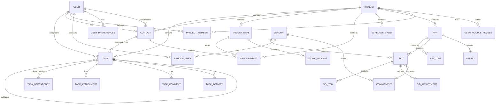

# Data & Schema Documentation

[← Back to Main](../SOURCE_OF_TRUTH.md)

## Table of Contents
1. [Database Configuration](#database-configuration)
2. [Complete Schema](#complete-schema)
3. [Entity Relationship Diagram](#erd)
4. [Model Details](#model-details)
5. [Enumerations](#enumerations)
6. [Indexes & Constraints](#indexes)
7. [Migration Strategy](#migrations)

## Database Configuration {#database-configuration}

### Connection
- **Provider**: PostgreSQL
- **Connection String**: `DATABASE_URL` environment variable
- **SSL Mode**: Required for production
- **Connection Pooling**: Handled by Prisma Client
- **Location**: `prisma/schema.prisma`

### Prisma Client
```typescript
// lib/prisma.ts
import { PrismaClient } from '@prisma/client'

const globalForPrisma = globalThis as unknown as {
  prisma: PrismaClient | undefined
}

export const prisma = globalForPrisma.prisma ??
  new PrismaClient({
    log: process.env.NODE_ENV === 'development' ? ['query', 'error', 'warn'] : ['error'],
  })

if (process.env.NODE_ENV !== 'production') globalForPrisma.prisma = prisma
```

## Complete Schema {#complete-schema}

The database schema is defined in `prisma/schema.prisma` with 40+ models covering:
- User management and authentication
- Project organization
- Task management with dual assignment
- Budget and procurement tracking
- RFP/Bidding system
- Schedule and calendar management
- Document and file management
- Audit logging

## Entity Relationship Diagram {#erd}



## Model Details {#model-details}

### Core Models

#### User
**File**: `prisma/schema.prisma:10-20`
**Purpose**: System users with authentication and role management

| Field | Type | Nullable | Default | Description |
|-------|------|----------|---------|-------------|
| id | String | No | - | Firebase UID (Primary Key) |
| email | String | No | - | Unique email address |
| role | Role | No | - | System role (ADMIN/STAFF/CONTRACTOR/VIEWER) |
| createdAt | DateTime | No | now() | Account creation timestamp |

**Relations**:
- `contact`: One-to-one with Contact (optional)
- `tasks`: One-to-many with Task (assigned tasks)
- `projectMemberships`: One-to-many with ProjectMember
- `vendorAccess`: One-to-many with VendorUser
- `preferences`: One-to-one with UserPreferences

#### Project
**File**: `prisma/schema.prisma:22-67`
**Purpose**: Project container with all related entities

| Field | Type | Nullable | Default | Description |
|-------|------|----------|---------|-------------|
| id | String | No | cuid() | Primary key |
| name | String | No | - | Project name |
| status | String | No | - | Project status |
| totalBudget | Decimal | Yes | - | Total project budget |
| startDate | DateTime | Yes | - | Project start date |
| targetEndDate | DateTime | Yes | - | Target completion |
| isArchived | Boolean | No | false | Archive flag |
| isFavorite | Boolean | No | false | Favorite flag |

**Key Relations**: All major entities (Tasks, Contacts, Budget, RFPs, etc.)

#### Task
**File**: `prisma/schema.prisma:98-159`
**Purpose**: Work items with dual assignment system

| Field | Type | Nullable | Default | Description |
|-------|------|----------|---------|-------------|
| id | String | No | cuid() | Primary key |
| projectId | String | No | - | Parent project |
| title | String | No | - | Task title |
| status | TaskStatus | No | TODO | Current status |
| priority | TaskPriority | No | MEDIUM | Task priority |
| assignedToId | String | Yes | - | Assigned user (mutual exclusivity with assignedContactId) |
| assignedContactId | String | Yes | - | Assigned contact (mutual exclusivity with assignedToId) |
| dueDate | DateTime | Yes | - | Due date |

**Dual Assignment Pattern**: Tasks can be assigned to EITHER a User (`assignedToId`) OR a Contact (`assignedContactId`), never both.

#### Contact
**File**: `prisma/schema.prisma:69-96`
**Purpose**: External contacts with optional portal access

| Field | Type | Nullable | Default | Description |
|-------|------|----------|---------|-------------|
| id | String | No | cuid() | Primary key |
| projectId | String | No | - | Parent project |
| name | String | No | - | Contact name |
| userId | String | Yes | - | Linked user account (portal access) |
| portalStatus | String | No | NONE | Portal invitation status |
| inviteToken | String | Yes | - | Unique invitation token |

**Portal Access Flow**:
1. Contact created without userId
2. Invitation sent with unique token
3. Contact accepts at `/accept-invite`
4. User account created and linked via userId

### Financial Models

#### BudgetItem
**File**: `prisma/schema.prisma:180-200`
**Purpose**: Budget line items with tracking

| Field | Type | Nullable | Default | Description |
|-------|------|----------|---------|-------------|
| discipline | String | No | - | Work discipline |
| category | String | No | - | Budget category |
| estTotal | Decimal | No | 0 | Estimated total |
| committedTotal | Decimal | No | 0 | Committed amount |
| paidToDate | Decimal | No | 0 | Paid to date |
| variance | Decimal | No | 0 | Budget variance |

#### Procurement
**File**: `prisma/schema.prisma:202-247`
**Purpose**: Material and service procurement tracking

| Field | Type | Nullable | Default | Description |
|-------|------|----------|---------|-------------|
| materialItem | String | No | - | Item description |
| quantity | Decimal | No | - | Order quantity |
| orderStatus | ProcurementStatus | No | DRAFT | Current status |
| poNumber | String | Yes | - | Unique PO number |
| supplierId | String | Yes | - | Supplier contact |

### Bidding System Models

#### Rfp (Request for Proposal)
**File**: `prisma/schema.prisma:365-385`
**Purpose**: Bid request management

| Field | Type | Nullable | Default | Description |
|-------|------|----------|---------|-------------|
| title | String | No | - | RFP title |
| dueAt | DateTime | No | - | Submission deadline |
| status | RfpStatus | No | DRAFT | Current status |

#### Bid
**File**: `prisma/schema.prisma:450-469`
**Purpose**: Vendor bid submissions

| Field | Type | Nullable | Default | Description |
|-------|------|----------|---------|-------------|
| rfpId | String | No | - | Parent RFP |
| vendorId | String | No | - | Submitting vendor |
| status | BidStatus | No | DRAFT | Submission status |
| submittedAt | DateTime | Yes | - | Submission timestamp |

### User Preferences
**File**: `prisma/schema.prisma:1053-1125`
**Purpose**: Comprehensive user settings and preferences

| Category | Fields | Purpose |
|----------|--------|---------|
| Navigation | mobileNavItems, navItemOrder, quickActions | UI customization |
| Appearance | theme, density, fontSize, colorBlindMode | Visual preferences |
| Display | showCompleted, defaultView, itemsPerPage | Display options |
| Notifications | emailNotifications, pushNotifications, digestFrequency | Alert settings |
| Privacy | profileVisibility, twoFactorMethod, sessionTimeout | Security settings |
| Mobile | swipeActions, hapticFeedback, biometricAuth | Mobile features |

## Enumerations {#enumerations}

### User & Access
```prisma
enum Role {
  ADMIN
  STAFF
  CONTRACTOR
  VIEWER
}

enum Module {
  TASKS
  SCHEDULE
  BUDGET
  PROCUREMENT
  CONTACTS
  PROJECTS
  PROPOSALS
  RFIS
  SUBMITTALS
  CHANGE_ORDERS
  SAFETY
  WEATHER
  PHOTOS
  PLANS
  UPLOADS
  INVOICES
  PROCUREMENT_READ
  DOCS_READ
  BIDDING
}
```

### Task Management
```prisma
enum TaskStatus {
  TODO
  IN_PROGRESS
  IN_REVIEW
  BLOCKED
  COMPLETED
  CANCELLED
}

enum TaskPriority {
  LOW
  MEDIUM
  HIGH
  URGENT
  CRITICAL
}
```

### Financial
```prisma
enum BudgetStatus {
  BUDGETED
  COMMITTED
  PAID
}

enum ProcurementStatus {
  QUOTED
  ORDERED
  DELIVERED
  INSTALLED
  DRAFT
  APPROVED
  SHIPPED
  CANCELLED
}

enum InvoiceStatus {
  RECEIVED
  UNDER_REVIEW
  APPROVED
  PAID
  REJECTED
}
```

### Bidding
```prisma
enum RfpStatus {
  DRAFT
  PUBLISHED
  CLOSED
}

enum BidStatus {
  DRAFT
  SUBMITTED
  WITHDRAWN
}

enum CommitmentType {
  CONTRACT
  PO
  CHANGE_ORDER
}

enum UnitOfMeasure {
  EA    // Each
  LF    // Linear Feet
  SF    // Square Feet
  CY    // Cubic Yard
  CF    // Cubic Feet
  TON   // Ton
  LB    // Pound
  GAL   // Gallon
  HR    // Hour
  DAY   // Day
  LS    // Lump Sum
  LOT   // Lot
}
```

## Indexes & Constraints {#indexes}

### Performance Indexes

| Model | Index | Fields | Purpose |
|-------|-------|--------|---------|
| Contact | Composite | projectId, portalStatus | Portal queries |
| Contact | Single | inviteToken | Token lookup |
| Task | Composite | projectId, status, dueDate | Task lists |
| Task | Composite | projectId, assignedToId | User tasks |
| Task | Single | parentTaskId | Subtask queries |
| ScheduleEvent | Composite | projectId, start DESC | Calendar views |
| BudgetItem | Composite | projectId, discipline, status | Budget reports |
| Procurement | Composite | projectId, requiredBy, orderStatus | Order tracking |
| Risk | Composite | projectId, status, score DESC | Risk matrix |

### Unique Constraints

| Model | Fields | Purpose |
|-------|--------|---------|
| User | email | Prevent duplicate accounts |
| Contact | inviteToken | Unique invitation links |
| ProjectMember | projectId, userId | One membership per user per project |
| Procurement | poNumber | Unique PO numbers |
| Rfp | projectId, title | Unique RFP names per project |
| BidInvitation | rfpId, vendorId | One invitation per vendor per RFP |
| Bid | rfpId, vendorId | One bid per vendor per RFP |

### Foreign Key Constraints

All relations use Prisma's default referential actions:
- **CASCADE**: Delete related records (e.g., Task attachments when task deleted)
- **SET NULL**: Set to null on delete (e.g., optional relations)
- **RESTRICT**: Prevent deletion if references exist (default)

## Migration Strategy {#migrations}

### Development Workflow
```bash
# Make schema changes
# Generate migration
npx prisma migrate dev --name descriptive_name

# Apply to development database
npx prisma migrate dev

# Generate updated client
npx prisma generate
```

### Production Deployment
```bash
# Apply pending migrations
npx prisma migrate deploy

# Verify migration status
npx prisma migrate status
```

### Migration Files
Located in `prisma/migrations/` with timestamp-based naming:
- `20240101000000_initial_schema/`
- `20240115000000_add_bidding_system/`
- `20240201000000_add_user_preferences/`

### Rollback Strategy
1. Keep migration files in version control
2. Test migrations in staging environment
3. Create backup before production deployment
4. Use `prisma migrate resolve` for failed migrations

## Data Integrity Patterns {#integrity}

### Dual Assignment Validation
```typescript
// Task can have EITHER assignedToId OR assignedContactId, not both
if (assignedToId && assignedContactId) {
  throw new Error('Task cannot be assigned to both user and contact')
}
```

### Soft Deletes
Projects use `isArchived` flag instead of deletion to maintain referential integrity.

### Audit Trail
`AuditLog` model tracks all significant data changes:
```prisma
model AuditLog {
  id        String   @id @default(cuid())
  userId    String
  action    String   // CREATE, UPDATE, DELETE, etc.
  entity    String   // Model name
  entityId  String   // Record ID
  meta      Json     // Change details
  createdAt DateTime @default(now())
}
```

### Idempotency
Commitments use `idempotencyKey` to prevent duplicate transactions:
```prisma
@@unique([projectId, idempotencyKey])
```

---

[Next: API Inventory →](02-api-inventory.md) | [Back to Main →](../SOURCE_OF_TRUTH.md)