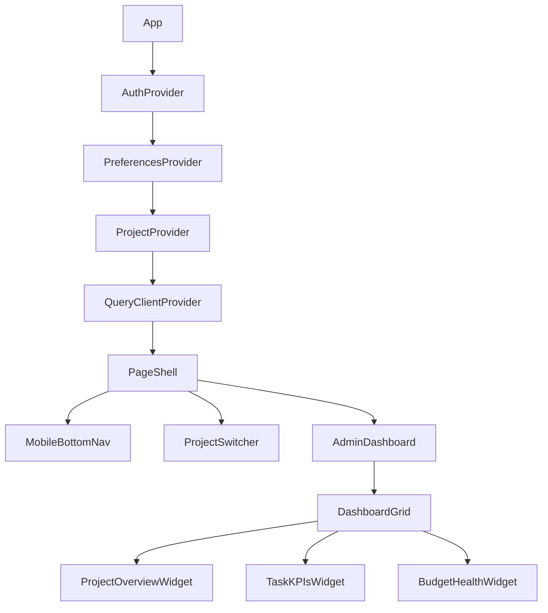

# Frontend Routes & Components Documentation

[← Back to Main](../SOURCE_OF_TRUTH.md)

## Table of Contents
1. [Route Structure](#route-structure)
2. [Page Components](#page-components)
3. [Component Library](#component-library)
4. [Hooks](#hooks)
5. [Context Providers](#contexts)
6. [Mobile Patterns](#mobile-patterns)

## Route Structure {#route-structure}

### Next.js 15 App Router Layout

```
app/
├── (auth)/           # Public authentication group
│   └── login/
├── admin/            # Admin dashboard (ADMIN, STAFF)
│   ├── tasks/
│   ├── schedule/
│   ├── budget/
│   ├── contacts/
│   ├── procurement/
│   ├── bidding/
│   └── settings/
├── contractor/       # Contractor portal (CONTRACTOR)
├── accept-invite/    # Public invitation flow
└── api/             # API routes
```

### Route Inventory

| Path | File | Auth | Roles | SSR/CSR | Features |
|------|------|------|-------|---------|----------|
| `/` | `app/page.tsx` | No | - | SSR | Landing page |
| `/login` | `app/(auth)/login/page.tsx` | No | - | CSR | Firebase auth |
| `/accept-invite` | `app/accept-invite/page.tsx` | No | - | CSR | Portal signup |
| `/admin` | `app/admin/page.tsx` | Yes | ADMIN, STAFF | CSR | Dashboard |
| `/admin/tasks` | `app/admin/tasks/page.tsx` | Yes | ADMIN, STAFF | CSR | Task management |
| `/admin/schedule` | `app/admin/schedule/page.tsx` | Yes | ADMIN, STAFF | CSR | Calendar view |
| `/admin/budget` | `app/admin/budget/page.tsx` | Yes | ADMIN | CSR | Budget tracking |
| `/admin/contacts` | `app/admin/contacts/page.tsx` | Yes | ADMIN, STAFF | CSR | Contact CRM |
| `/admin/procurement` | `app/admin/procurement/page.tsx` | Yes | Module | CSR | Orders |
| `/admin/bidding` | `app/admin/bidding/page.tsx` | Yes | ADMIN | CSR | RFP/Bids |
| `/admin/settings` | `app/admin/settings/page.tsx` | Yes | ALL | CSR | Preferences |
| `/contractor` | `app/contractor/page.tsx` | Yes | CONTRACTOR | CSR | Portal |

## Page Components {#page-components}

### Admin Dashboard
**File**: `app/admin/page.tsx`
**Components Used**:
- `PageShell` - Layout wrapper
- `DashboardGrid` - Responsive grid
- `ProjectOverviewWidget` - Project stats
- `TaskKPIsWidget` - Task metrics
- `BudgetHealthWidget` - Budget status
- `WelcomeWidget` - User greeting

### Tasks Page
**File**: `app/admin/tasks/page.tsx`
**Key Features**:
- Kanban board view (`KanbanBoard`)
- List view (`MobileListView`)
- Filter bar (`TaskFilterBar`)
- View switcher (`ViewSwitcher`)
- Mobile task cards (`MobileTaskCard`)
- Desktop task cards (`TaskCard`)

**Task Assignment UI**:
```tsx
// Dual assignment pattern
<Select name="assignedTo">
  <optgroup label="Team Members">
    {users.map(user => <option value={`user:${user.id}`}>{user.name}</option>)}
  </optgroup>
  <optgroup label="Contacts">
    {contacts.map(contact => <option value={`contact:${contact.id}`}>{contact.name}</option>)}
  </optgroup>
</Select>
```

### Schedule Page
**File**: `app/admin/schedule/page.tsx`
**Components**:
- `FullCalendarView` - Calendar integration
- `EventDialog` - Event creation/editing
- `FilterPanel` - Event filters
- `KpiCarousel` - Schedule metrics
- `MobileEventCard` - Mobile event display

## Component Library {#component-library}

### UI Components (shadcn/ui)
Located in `components/ui/`

#### Core Components

| Component | File | Props Interface | Usage |
|-----------|------|-----------------|-------|
| Button | `button.tsx` | `ButtonProps extends ButtonHTMLAttributes` | Primary CTA |
| Card | `card.tsx` | `CardProps extends HTMLAttributes` | Content containers |
| Dialog | `dialog.tsx` | `DialogProps` | Modal dialogs |
| Input | `input.tsx` | `InputProps extends InputHTMLAttributes` | Form inputs |
| Select | `select.tsx` | `SelectProps` | Dropdowns |
| Table | `table.tsx` | `TableProps` | Data tables |

#### Mobile-Specific Components

| Component | File | Purpose |
|-----------|------|---------|
| BottomSheet | `bottom-sheet.tsx` | Mobile modal |
| MobileCard | `mobile/card.tsx` | Touch-optimized cards |
| MobileDialog | `mobile/dialog.tsx` | Full-screen dialogs |
| DetailSheet | `mobile/detail-sheet.tsx` | Slide-up details |

### Block Components
Located in `components/blocks/`

#### PageShell
**File**: `page-shell.tsx`
**Props**:
```typescript
interface PageShellProps {
  children: React.ReactNode
  title?: string
  showProjectSwitcher?: boolean
  mobileNavItems?: string[]
}
```

#### DashboardGrid
**File**: `dashboard-grid.tsx`
**Props**:
```typescript
interface DashboardGridProps {
  widgets: WidgetConfig[]
  columns?: { mobile: number; tablet: number; desktop: number }
}
```

### Task Components
Located in `components/tasks/`

#### TaskCard
**File**: `task-card.tsx`
**Props**:
```typescript
interface TaskCardProps {
  task: Task
  onSelect?: (task: Task) => void
  onStatusChange?: (taskId: string, status: TaskStatus) => void
  showProject?: boolean
  isDragging?: boolean
}
```

#### KanbanBoard
**File**: `kanban-board.tsx`
**Props**:
```typescript
interface KanbanBoardProps {
  tasks: Task[]
  onTaskMove?: (taskId: string, newStatus: TaskStatus) => void
  onTaskSelect?: (task: Task) => void
}
```

### Contact Components
Located in `components/contacts/`

#### ContactCard
**File**: `contact-card.tsx`
**Props**:
```typescript
interface ContactCardProps {
  contact: Contact
  onEdit?: (contact: Contact) => void
  onDelete?: (contactId: string) => void
  onInvite?: (contactId: string) => void
}
```

## Hooks {#hooks}

### API Hooks
**File**: `hooks/use-api.ts`

| Hook | Purpose | Query Key | Returns |
|------|---------|-----------|---------|
| `useProjects()` | Fetch projects | `['projects']` | Projects array |
| `useTasks(query)` | Fetch tasks | `['tasks', query]` | Tasks with pagination |
| `useTask(id)` | Single task | `['task', id]` | Task details |
| `useContacts(query)` | Fetch contacts | `['contacts', query]` | Contacts array |
| `useBudget(projectId)` | Budget items | `['budget', { projectId }]` | Budget data |
| `useProcurement(query)` | Orders | `['procurement', query]` | Procurement items |

### Mutation Hooks

| Hook | Purpose | Invalidates | Example |
|------|---------|-------------|---------|
| `useCreateTask()` | Create task | `['tasks']` | `mutate({ title, projectId })` |
| `useUpdateTask()` | Update task | `['tasks', 'task']` | `mutate({ id, ...data })` |
| `useUpdateTaskStatus()` | Status change | `['tasks']` | `mutate({ id, status })` |
| `useDeleteTask()` | Delete task | `['tasks']` | `mutate(taskId)` |

### UI Hooks

| Hook | File | Purpose | Returns |
|------|------|---------|---------|
| `useMediaQuery(query)` | `use-media-query.ts` | Responsive checks | boolean |
| `useResponsive()` | `use-responsive.ts` | Device detection | `{ isMobile, isTablet, isDesktop }` |
| `useSwipeGestures()` | `use-swipe-gestures.ts` | Touch gestures | Swipe handlers |
| `useToast()` | `use-toast.ts` | Notifications | `{ toast, dismiss }` |
| `usePreferences()` | `use-preferences.ts` | User settings | Preferences object |

## Context Providers {#contexts}

### AuthContext
**File**: `app/contexts/AuthContext.tsx`
**Provider**: `AuthProvider`
**Hook**: `useAuth()`

```typescript
interface AuthContextType {
  user: User | null
  loading: boolean
  error: string | null
  signInWithEmail: (email: string, password: string) => Promise<void>
  signInWithGoogle: () => Promise<void>
  logout: () => Promise<void>
  userRole: string | null
  userModules: string[] | null
}
```

**Token Refresh**: Automatic every 50 minutes

### PreferencesContext
**File**: `app/contexts/PreferencesContext.tsx`
**Provider**: `PreferencesProvider`
**Hook**: `usePreferences()`

```typescript
interface PreferencesContextType {
  preferences: UserPreferences
  updatePreferences: (updates: Partial<UserPreferences>) => Promise<void>
  resetPreferences: () => Promise<void>
  loading: boolean
}
```

### ProjectContext
**File**: `app/contexts/ProjectContext.tsx`
**Provider**: `ProjectProvider`
**Hook**: `useProject()`

```typescript
interface ProjectContextType {
  currentProject: Project | null
  setCurrentProject: (project: Project) => void
  projects: Project[]
  loading: boolean
}
```

## Mobile Patterns {#mobile-patterns}

### Responsive Breakpoints
```typescript
// tailwind.config.ts
screens: {
  'sm': '640px',   // Mobile landscape
  'md': '768px',   // Tablet
  'lg': '1024px',  // Desktop
  'xl': '1280px',  // Large desktop
  '2xl': '1536px'  // Wide screen
}
```

### Mobile-First Components

#### Bottom Navigation
**File**: `components/blocks/mobile-bottom-nav.tsx`
```typescript
interface MobileBottomNavProps {
  items: NavItem[]
  activeItem: string
  onItemSelect: (item: string) => void
}
```

#### Touch Targets
All interactive elements maintain 48px minimum touch target:
```css
.touch-target {
  @apply min-h-[48px] min-w-[48px];
}
```

#### Swipe Actions
```typescript
// components/tasks/mobile-task-card.tsx
const { onSwipeLeft, onSwipeRight } = useSwipeActions({
  onComplete: () => updateStatus('COMPLETED'),
  onArchive: () => updateStatus('ARCHIVED'),
  threshold: 100
})
```

### Adaptive Layouts

#### Card/Table Toggle
```typescript
const TaskList = () => {
  const { isMobile } = useResponsive()

  return isMobile ? (
    <MobileListView tasks={tasks} />
  ) : (
    <DataTable columns={columns} data={tasks} />
  )
}
```

#### Bottom Sheet vs Modal
```typescript
const EditDialog = ({ open, onClose, children }) => {
  const { isMobile } = useResponsive()

  return isMobile ? (
    <BottomSheet open={open} onOpenChange={onClose}>
      {children}
    </BottomSheet>
  ) : (
    <Dialog open={open} onOpenChange={onClose}>
      {children}
    </Dialog>
  )
}
```

## Component Tree Example



## Form Patterns

### React Hook Form Integration
```typescript
// Example: Task creation form
const TaskForm = () => {
  const form = useForm<TaskFormValues>({
    resolver: zodResolver(taskSchema),
    defaultValues: {
      title: '',
      status: 'TODO',
      priority: 'MEDIUM'
    }
  })

  const onSubmit = async (data: TaskFormValues) => {
    await createTask.mutateAsync(data)
  }

  return (
    <Form {...form}>
      <form onSubmit={form.handleSubmit(onSubmit)}>
        <FormField
          control={form.control}
          name="title"
          render={({ field }) => (
            <FormItem>
              <FormLabel>Title</FormLabel>
              <FormControl>
                <Input {...field} />
              </FormControl>
              <FormMessage />
            </FormItem>
          )}
        />
      </form>
    </Form>
  )
}
```

## Loading & Error States

### Skeleton Loading
```typescript
const TaskListSkeleton = () => (
  <div className="space-y-4">
    {[...Array(5)].map((_, i) => (
      <Skeleton key={i} className="h-24 w-full" />
    ))}
  </div>
)
```

### Error Boundaries
```typescript
// app/admin/error.tsx
export default function Error({
  error,
  reset,
}: {
  error: Error
  reset: () => void
}) {
  return (
    <div className="flex flex-col items-center justify-center min-h-[400px]">
      <h2>Something went wrong!</h2>
      <button onClick={reset}>Try again</button>
    </div>
  )
}
```

---

[Next: Auth & Security →](04-auth-security.md) | [Back to Main →](../SOURCE_OF_TRUTH.md)