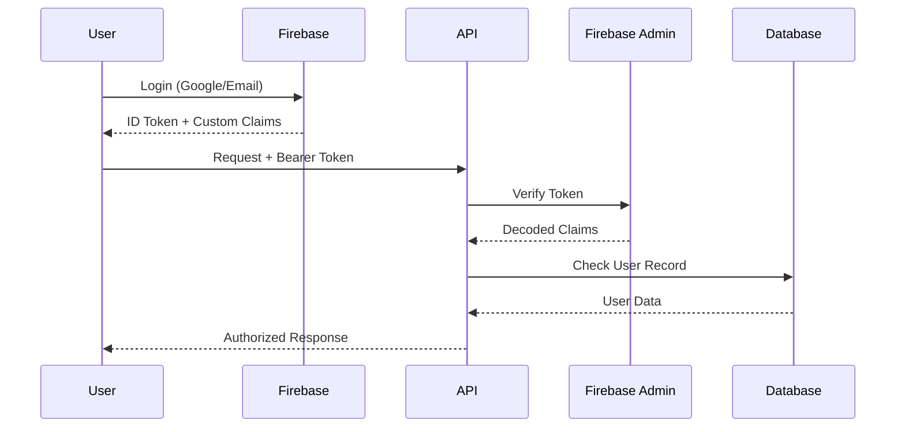

# Authentication & Security Documentation

[← Back to Main](../SOURCE_OF_TRUTH.md)

## Authentication Flow

### Firebase Authentication
**Client SDK**: `lib/firebaseClient.ts`
**Admin SDK**: `lib/firebaseAdmin.ts`



### Token Management
- **Expiry**: 1 hour
- **Refresh**: Automatic every 50 minutes (`app/contexts/AuthContext.tsx:74`)
- **Storage**: Memory only (no localStorage)
- **Headers**: `Authorization: Bearer <token>`

## Role-Based Access Control (RBAC)

### Roles
| Role | Capabilities | Evidence |
|------|-------------|----------|
| ADMIN | Full system access | `prisma/schema.prisma:869` |
| STAFF | Project management | `prisma/schema.prisma:870` |
| CONTRACTOR | Module-based access | `prisma/schema.prisma:871` |
| VIEWER | Read-only access | `prisma/schema.prisma:872` |

### Module Permissions
**Model**: `UserModuleAccess` (`prisma/schema.prisma:324-335`)

```typescript
interface ModuleAccess {
  module: Module    // TASKS, SCHEDULE, BUDGET, etc.
  canView: boolean
  canEdit: boolean
  canUpload: boolean
  canRequest: boolean
}
```

### Authorization Middleware
**File**: `lib/api/auth-check.ts`

```typescript
// Basic auth
const user = await requireAuth(request)

// Role-based
const user = await requireRole(['ADMIN', 'STAFF'], request)

// Module-based
const hasAccess = await checkModuleAccess(userId, projectId, 'TASKS')
```

## Security Measures

### Input Validation
- **Framework**: Zod (`lib/validations/*`)
- **Location**: All API endpoints
- **Pattern**: Parse → Validate → Execute

### SQL Injection Prevention
- **Method**: Prisma parameterized queries
- **No raw SQL**: All queries use Prisma Client

### XSS Prevention
- **React**: Automatic escaping
- **Content-Type**: Always `application/json`
- **No `dangerouslySetInnerHTML`**

### CSRF Protection
- **Cookies**: SameSite=Strict
- **Token validation**: Every request

### Rate Limiting
**File**: `lib/api/rate-limit.ts`

| Role | Limit/min | Implementation |
|------|-----------|----------------|
| ADMIN | 1000 | IP + User ID |
| STAFF | 500 | IP + User ID |
| CONTRACTOR | 200 | IP + User ID |
| VIEWER | 100 | IP + User ID |
| PUBLIC | 50 | IP only |

## Session Management
**File**: `lib/api/session.ts`

```typescript
interface Session {
  id: string
  userId: string
  createdAt: Date
  expiresAt: Date
  lastActivity: Date
}
```

- **Storage**: Database (optional)
- **Timeout**: Configurable (default: 7 days)
- **Validation**: On every request

## Webhook Security
**Endpoints**: `/api/webhooks/*`
**Authentication**: Header-based

```bash
curl -X POST "/api/webhooks/gmail-inbound" \
  -H "x-webhook-secret: ${WEBHOOK_SECRET}" \
  -H "Content-Type: application/json" \
  -d '{"data": "..."}'
```

## File Upload Security
**Storage**: Firebase Storage
**Access**: Signed URLs only

```typescript
// Generate signed URL (expires in 1 hour)
const signedUrl = await getSignedUrl(file, {
  action: 'read',
  expires: Date.now() + 3600 * 1000
})
```

## Audit Logging
**Model**: `AuditLog` (`prisma/schema.prisma:353-361`)

```typescript
interface AuditLog {
  userId: string
  action: string    // CREATE, UPDATE, DELETE
  entity: string    // Model name
  entityId: string
  meta: Json       // Change details
  createdAt: Date
}
```

## Security Headers
**File**: `middleware.ts`

```typescript
headers: {
  'X-Frame-Options': 'DENY',
  'X-Content-Type-Options': 'nosniff',
  'X-XSS-Protection': '1; mode=block',
  'Referrer-Policy': 'strict-origin-when-cross-origin',
  'Content-Security-Policy': "default-src 'self'"
}
```

## Data Privacy

### PII Handling
- **Encryption**: At rest (database)
- **Redaction**: Logs sanitized
- **Access**: Role-restricted

### GDPR Compliance
- **Data export**: User preferences API
- **Data deletion**: Soft delete with cleanup
- **Consent**: Tracked in preferences

## Security Testing
**Location**: `__tests__/security/`

| Test | File | Coverage |
|------|------|----------|
| RBAC | `rbac.test.ts` | Role enforcement |
| IDOR | `idor.test.ts` | ID access control |
| Rate Limiting | `rate-limit.test.ts` | Throttling |
| Data Protection | `data-protection.test.ts` | PII handling |
| Headers | `security-headers.test.ts` | Security headers |

---

[Next: State Management →](05-state-management.md) | [Back to Main →](../SOURCE_OF_TRUTH.md)